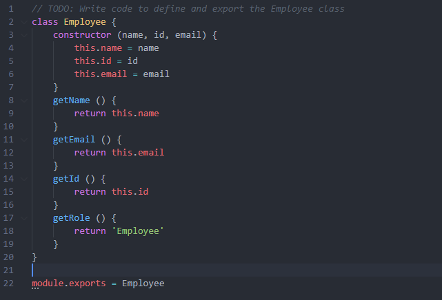
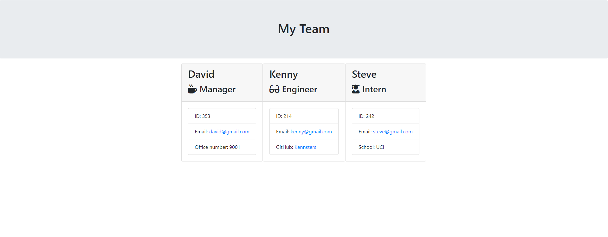

# TemplateEngine

##Assignment Description
In this assignment we are to build a template generator for a manager that wants to build a webpage that will display their team's basic info. 

##Assignment 
###NPM
We started the homework by installing the NPM. The two that we used are Inquirer (for the main functionality of the assignment) and Jest(to test the constructors that we built)

###How the Code Works
The actual code does not start until line 84 with our function buildEmployee (). Here we prompt the user with a select set of questions(name, email, id, and role). Depending on the selection for role, we built a switch case to call the other functions (buildEngineer(), buildIntern(), buildManager()). 

In each of the specific functions we also ask a unique question to that specific employee. We then push the values from our buildEmployee and unique build functions onto an array called Employees.

We then prompt the user to ask if they would like to add another employee or finish the list. If they add another employee we will run the buildEmployee() which will start the whole process over. With the finish selection, we will render the list onto a file output where we will create a new html file called team.html

